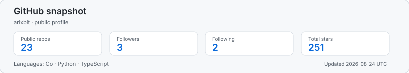
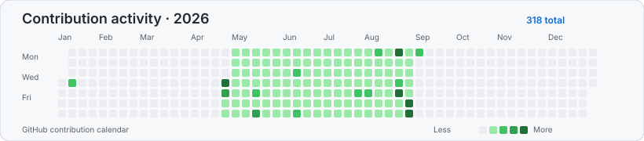

# 😄 Hi there, I'm ArixBit 👋

🎉 Welcome to my GitHub profile!

👨🏻‍💻 I'm ArixBit - a Go、PHP、Python developer
📍 From China 

- 💬 Ask me about anything an everything.
- 📫 Read my blogs: [ArixBit](https://arixbit.me)

<!--
**arixbit/arixbit** is a ✨ _special_ ✨ repository because its `README.md` (this file) appears on your GitHub profile.

Here are some ideas to get you started:

- 🔭 I’m currently working on ...
- 🌱 I’m currently learning ...
- 👯 I’m looking to collaborate on ...
- 🤔 I’m looking for help with ...
- 💬 Ask me about ...
- 📫 How to reach me: ...
- 😄 Pronouns: ...
- ⚡ Fun fact: ...
-->
